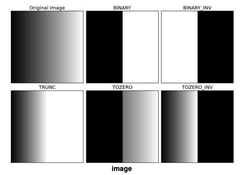

# Thresholding

Process of converting a grayscale image into a binary image based on the intensity of the pixels. Binary images are used extensively in computer vision applications, as they allow you to selectively process specific regions of an image, keeping the other regions intact. 

The processing power, time, storage size and such other factors are affected by the type of image when running any algorithms on the image, i.e., it is much faster to run algorithms on a binary image, less on a grayscale image and least fastest on a colour image. 

Thresholding is also one of the most simpliest forms of segmentation. One of the most common usecases of thresholding is to create a mask of an object where the pixels associated with the object are assigned a value of 1 and the rest (background) is assigned a value of 0. This masking technique is used as the first step in a lot of Computer/Machine Vision allgorithms.  

There are two ways to threshold an image:
1. Global Threshold
1. Adaptive Threshold

## Global Threshold

In global threshold, the same algorithm is applied on the same image, irrespetive of the brightness and illumination of certain regions of the image. To differentiate the pixels that are interesting to user from the rest, a comparision of each pixel intensity value with respect to a threshold (determined according to the problem to solve) is performed and the interesting pixels are set with a determined value to identity them (i.e. they are assigned a value of 0 (black), 255 (white) or any value based on the needs of the user).

In OpenCV, it is implemented using the `threshold()` function and has the following types.
Note: `threshold()` only accepts a grayscale image as input. 

### Threshold Binary 
In OpenCV, `THRESH_BINARY` is the CONST used to represent it. 
```
    if src(x,y) > thresholdValue
        dst(x,y) = maxValue
    else
        dst(x,y) = 0
```
### Threshold Binary, Inverted
In OpenCV, `THRESH_BINARY_INV` is the CONST used to represent it. 
```
    if src(x,y) > thresholdValue
        dst(x,y) = 0
    else
        dst(x,y) = maxValue
```
### Threshold Truncate
In OpenCV, `THRESH_TRUNC` is the CONST used to represent it. 
```
    if src(x,y) > thresholdValue
        dst(x,y) = thresholdValue
    else
        dst(x,y) = src(x,y)
```
### Threshold to Zero, Inverted
In OpenCV, `THRESH_TOZERO` is the CONST used to represent it. 
```
    if src(x,y) > thresholdValue
        dst(x,y) = src(x,y)
    else
        dst(x,y) = 0
```
### Threshold to Zero, Inverted
In OpenCV, `THRESH_TOZERO_INV` is the CONST used to represent it. 
```
    if src(x,y) > thresholdValue
        dst(x,y) = 0
    else
        dst(x,y) = src(x,y)
```



## OTSU's Binarization

## Adaptive Thresholding
In the previous section, we used one global value as a threshold. But this might not be good in all cases, e.g. if an image has different lighting conditions in different areas. In that case, adaptive thresholding thresholding can help. Here, the algorithm determines the threshold for a pixel based on a small region around it. So we get different thresholds for different regions of the same image which gives better results for images with varying illumination.